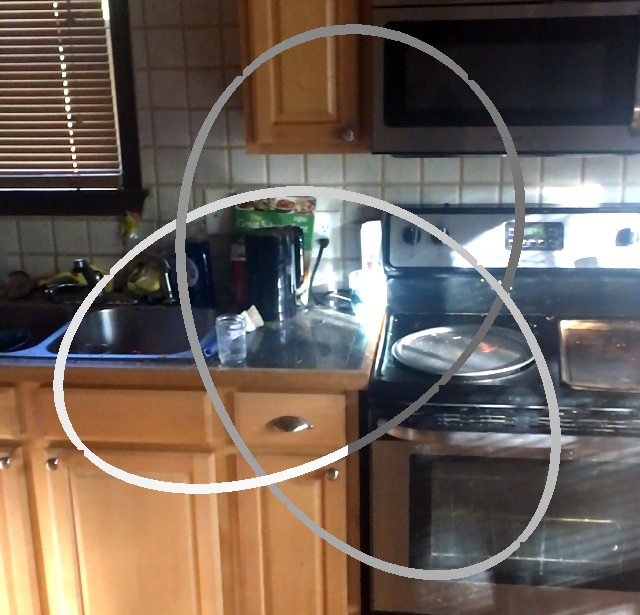
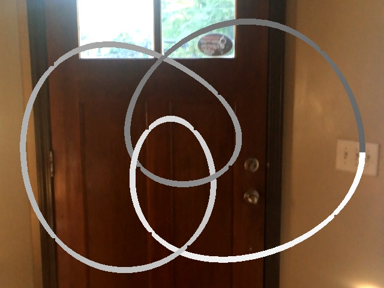
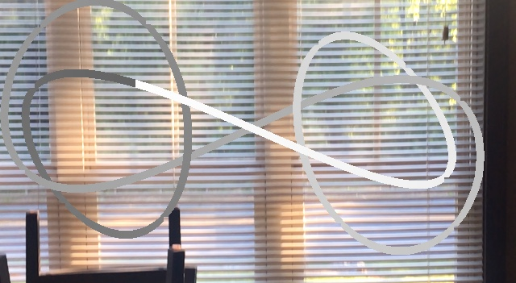
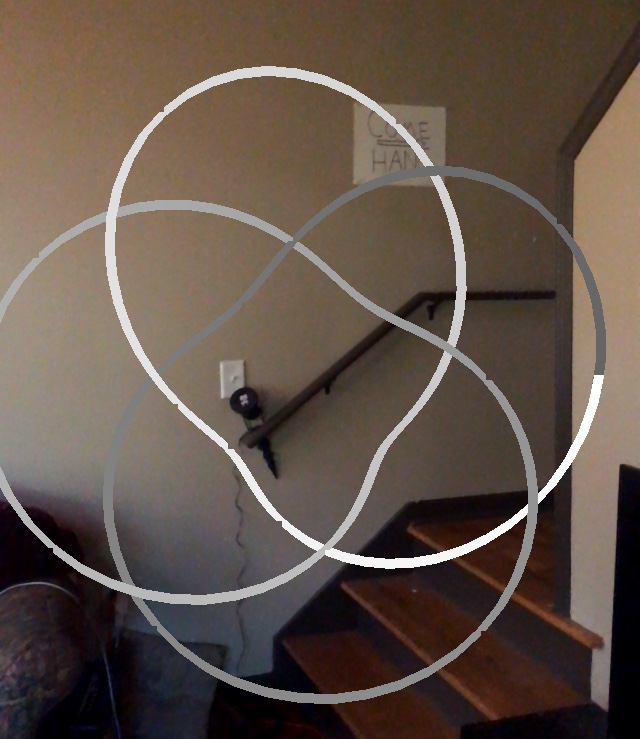
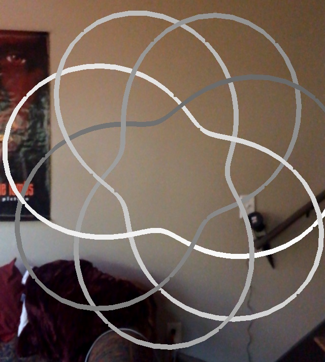
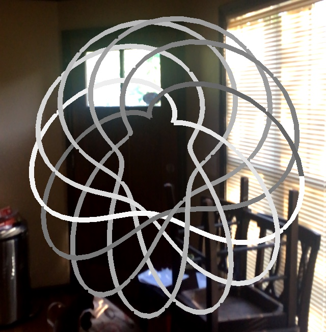

# AR Knots

This repository contains code written for my final individual project in **ARGD 4080, Mathematics Outreach Design Lab**, in which I've found parameterizations for 6 different knots and visualized them in a traversable augmented reality space. To watch this app in action, take a look at the video [here](https://vimeo.com/267052680).

Below you'll find descriptions of the 6 knots I chose to display, as well as pictures. 

## Knot 1

A simple trefoil with 3 crossings.

## Knot 2

A figure 8 knot with 4 crossings.

## Knot 3

The connected sum of two trefoils (otherwise known as a granny knot) with 6 crossings.

---

The last 3 knots all exist on the surface of a torus, differing by how many times they cross the meridian and longitudinal axis.

---

## Knot 4

A 3-4 torus (crossing meridian 3 times, longitudinal axis 4).

## Knot 5

A 4-7 torus (crossing meridian 4 times, longitudinal axis 7).

## Knot 6

A 6-11 torus (crossing meridian 6 times, longitudinal axis 11).

---

You can find more info on knots (and more parameterizations as well) at [paulbourke.net](http://paulbourke.net/geometry/knots/).
