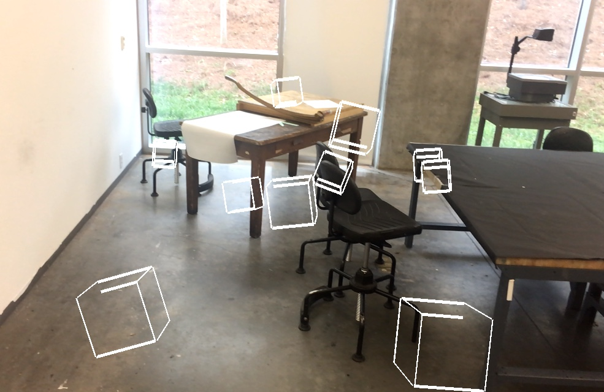

# cube-occlusion

draw cubes in AR! occlusion is a little buggy right now but still leads to some interesting images

also implemented a new tracking state notifier. the color of the circle in the top left corner of the screen changes according to these rules
- black: the system is initializing
- gray: excessive motion
- red: insufficient features (bad tracking state)
- blue: relocalizing
- white: good to go!
